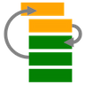
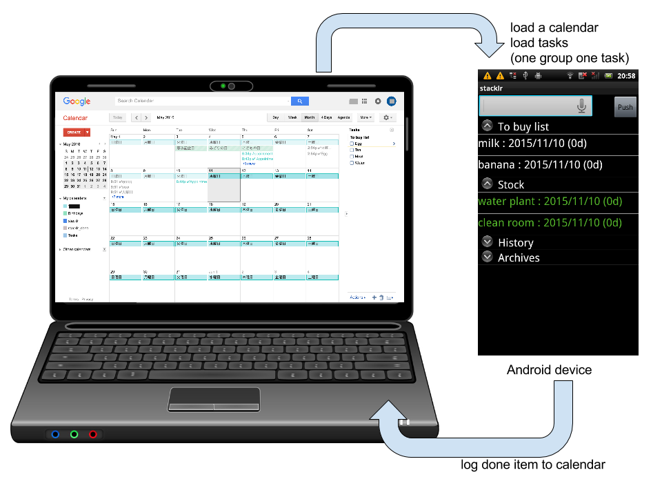

stacklr - Stack based shopping/TODO list  [](https://travis-ci.org/mamewotoko/stacklr)
========================================
Concept
-------
<pre>
  +----------
  | Apple   ^
  | Orange  | shopping list
  =========== 
  | Banana  | stock
  ===========
  | Sugar   V history: candidates to add to shopping list 
  +---------
</pre>


Functions
---------
* add new item to shopping list
   by keyboard of smart phone
   by voice
   from pc
* move shopping list to stock
   bought item but not consumed
* move stock to shopping list
   no stock
* load/save google calendar
  * upload to google task
  * load google calendar (named "stacklr" or primary calender if no stacklr calendar exists)
    * e.g. list recorded TV shows
    * e.g. weekly TODO like clean my room

* move history item to shopping list

Build(command line)
-------------------
1. install "Google Repository" using android sdk manager
2. create local.properties file which contains property ```sdk.dir=<path/to/android-sdk>```
(or android create project with gradle option)
3. build using gradlew

    ```bash
    ./gradlew build
    ```
3. debug apk file is generated to ```app/build/outputs/apk/app-debug.apk```

Build(Android Studio)
---------------------
select menu: Build -> Build APK

Robotium Test
-------------
1. connect device or start emulator with Gooogle APIs image
2. start testing

    ```bash
    ./gradlew connectedAndroidTest
    ```

TODO
-----
* log item transition to google calendar
  * add calendar if absent?
    * or list exising calendar
  * add ui to not log event
    * eg. canceled event (not done event)
  * view transition stack (recent item)
    * select undo item
  * buffer transitions which is not log to google calendar  
* use as memo tool (as new app?)
  * tab ui to switch
  * customizable group?
  * e.g. add songs to sing at next karaoke party?
  * e.g. copy to playlist of music player app?
* test
  * skip/handle google account chooser
  * prepare test environment
    * manymo looks good, but not free
    * android emulator with google api running on sakura vps is very slow (android app dies)
* add note of google task for each item
* save status by onSaveInstanceState
  * remove csv files
* add preference
  * color preference
  * move checked item to next group option
  * use new style
    https://www.google.com/design/spec/patterns/settings.html#settings-labels-secondary-text
* modify behavior when intent received from google app (by voice)
  * just add data and hide UI?
* add test using Espresso
* fork simple app project
  * use one task list
  * parent/child 
* shopping mode (filter)
  food/items, not event,action item
* switch to other google account (for testing only?)
* checklist
  * e.g. daily routine
  * e.g. have wallet, phone, bag, note before going shopping (do before)
* widget
* add classify label to each item (add to item notes/save locally?)
  * importance
  * urgency
* refine item type
  food & item (to buy, stock)
  TODO once/repeat
* items link to EC site
  * amazon (waiting/wish list/watch list..)
    * books
    * DVD
  * movies
* recommend new item?
* undo?
* search item?
* sync items with google tasks
  * move group
* support due date?
* sync with google task
  * item corresponding google task is removed
* bug
  * long click item
    -> later
    -> date
    -> cancel
    then, displayed date is changed, but should be current time
  * item with old google task id is not uploaded
  * performance problem (by commit b56b?)
    * load local items using async task
      onCreate takes 718msec
        setContentView: 110msec
          analyze
          use relative layout to reduce nested LinearLayout?
        ExpandableView: 52msec
          async load?
  * fix duplicate google task list is created
* use gradle to build project and fetch libraries
* add following groups as default
   * waiting (e.g. internet shopping)
   * wish list (not buy, but want to buy lator, display lower)
* avoid frequent load
   * by managing last update time
   * avoid loading group
* add test
   * install -> permit oauth -> load groups and tasks first time
   * start stacklr, push home button, start stacklr again (loading icon is not displayed)
   * reload by menu (loading icon is displayed)
   * operation to interact with google service UI
* add promote group (stock items to use first)
* add sync config
* add touch menu, which is just update timestamp (or push button for each item)
* draw icon
* examine NOTICE file of library
* add wording file and support multiple language
* UI with Action bar
  http://developer.android.com/guide/topics/ui/actionbar.html
* implement "push to history list"
    add checkbox to stack item
    use swipe to remove?
      https://github.com/47deg/android-swipelistview
      http://www.tutecentral.com/android-swipe-listview/
* implement "enter text by speech"
  * without dialog?
* add items in history as input suggestion
* task loader design
  * google tasks
  * google calendar
  * load task chain
      load groups -> load tasks -> upload tasks
* Data storage design
  * save items as JSON (dump gtask)
  * Write data storage interface
    * integrate with cursor adapter?
  * Support multiple storage
    * e.g. Redmine ticket
    * e.g. Github issue?
  * Save items to local database
* localize
   English
   Japanese
   Chinese?

MEMO
----
* Google Keep has no api yet
  http://stackoverflow.com/questions/19196238/is-there-a-google-keep-api
* Calendar API v3
  https://developers.google.com/resources/api-libraries/documentation/calendar/v3/java/latest/
* Google Tasks API
  https://developers.google.com/google-apps/tasks/?hl=ja
  * Authorizing with Google for REST APIs
    http://developer.android.com/google/auth/http-auth.html
  https://developers.google.com/accounts/docs/OAuth2
  * Tasks API v1 (Rev. 41) 1.20.0
    https://developers.google.com/resources/api-libraries/documentation/tasks/v1/java/latest/overview-summary.html
    * Sample code (mercurial repository)
      https://code.google.com/p/google-api-java-client.samples/
* Class Tasks
https://developers.google.com/resources/api-libraries/documentation/tasks/v1/java/latest/com/google/api/services/tasks/Tasks.html
* Robotium JavaDoc
  http://robotium.googlecode.com/svn/doc/index.html
* This code includes copies of [tasks-android-sample](https://code.google.com/p/google-api-java-client.samples/)
* [Profiling with Traceview and dmtracedump](http://developer.android.com/intl/ja/tools/debugging/debugging-tracing.html)
* release build with sign
  1. uncomment release configuration in app/build.gradle
  2. pass paramters as environment variables 
 
    ```
    KEYSTORE=/path/to/keystore KEY_ALIAS=ALIAS_NAME KEYSTORE_PASSWORD=xxxx KEY_PASSWORD=yyyyy ./gradlew assembleRelease
    ```
License
-------
```
   Copyright 2014-2016 Takashi Masuyama

   Licensed under the Apache License, Version 2.0 (the "License");
   you may not use this file except in compliance with the License.
   You may obtain a copy of the License at

       http://www.apache.org/licenses/LICENSE-2.0

   Unless required by applicable law or agreed to in writing, software
   distributed under the License is distributed on an "AS IS" BASIS,
   WITHOUT WARRANTIES OR CONDITIONS OF ANY KIND, either express or implied.
   See the License for the specific language governing permissions and
   limitations under the License.
```

----
Takashi Masuyama < mamewotoko@gmail.com >  
http://mamewo.ddo.jp/
