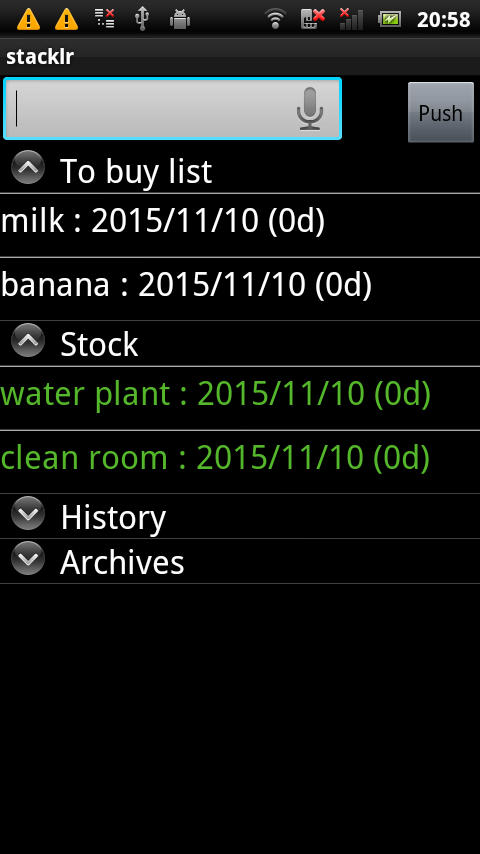

stacklr - Stack based shopping/TODO list  [](https://travis-ci.org/mamewotoko/stacklr)
========================================
Concept
-------
<pre>
  +----------
  | Apple   ^
  | Orange  | shopping list
  =========== 
  | Banana  | stock
  ===========
  | Sugar   V history: candidates to add to shopping list 
  +---------
</pre>



Functions
---------
* add new item to shopping list
   by keyboard of smart phone
   by voice
   from pc
* move shopping list to stock
   bought item but not consumed
* move stock to shopping list
   no stock
* upload to google task
* load google calendar (named "stacklr" or primary calender if no stacklr calendar exists)
  * e.g. list recorded TV shows
  * e.g. weekly TODO like clean my room
* move history item to shopping list

Build
-----
* copy google-play-service_lib code into libsrc directory
```bash
mkdir libsrc
cp $ANDROID_HOME/extras/google/google_play_services/libproject/google-play-services_lib libsrc/
```
* add libsrc/google-play-services_lib as library project
```bash
android update lib-project -p libsrc/google-play-services_lib -t android-16
```
* build using ant
```bash
ant debug
```

TODO
-----
* progress item
* add note
* add preference
  * move checked item to next group option
  * use new style
    https://www.google.com/design/spec/patterns/settings.html#settings-labels-secondary-text
* merge podplayer
* add test using Espresso
* log item transition
  file
  local database
  to google calendar?
* lib-project? (google task list data adapter)
  * add to malarm
* fork simple app project
  * use one task list
  * parent/child 
* shopping mode (filter)
  food/article, not event
* switch to other google account (for testing only?)
* later
  * assign specific date (scheduled, move to calender)
  * remind later(e.g. 3 days later)
* checklist
  * e.g. daily routine
  * e.g. have wallet, phone, bag, note before going shopping (do before)
* widget
* add classify label to each item (add to item notes/save locally?)
  * importance
  * urgency
* refine item type
  food & item (to buy, stock)
  TODO once/repeat
* items link to EC site
  amazon (waiting/wish list/watch list..)
    books
    DVD
  movies
  feedly
* recommend new item?
* undo?
* search item?
* sync items with google tasks
  * move group
* support due date?
* sync with google task
  * item corresponding google task is removed
* bug
  * performance problem by commit b56b?
    * load local items using async task
      onCreate takes 718msec
        use relative layout to reduce nested LinearLayout?
  * fix duplicate google task list is created
* use gradle to build project and fetch libraries
* add following groups as default
   * waiting (e.g. internet shopping)
   * wish list (not buy, but want to buy lator, display lower)
* avoid frequent load
   * by managing last update time
   * avoid loading group
* add test
   * install -> permit oauth -> load groups and tasks first time
   * start stacklr, push home button, start stacklr again (loading icon is not displayed)
   * reload by menu (loading icon is displayed)
   * operation to interact with google service UI
* add promote group (stock items to use first)
* add sync config
* add touch menu, which is just update timestamp (or push button for each item)
* draw icon
* add dialog to set item property
   item type
   button to select next group
   color?
* add licence file
* add wording file and support multiple language
* UI with Action bar
  http://developer.android.com/guide/topics/ui/actionbar.html
* implement "push to history list"
    add checkbox to stack item
    use swipe to remove?
      https://github.com/47deg/android-swipelistview
      http://www.tutecentral.com/android-swipe-listview/
* implement "enter text by speech"
  * without dialog?
* add items in history as input suggestion
* task loader design
  * google tasks
  * google calendar
  * load task chain
      load groups -> load tasks -> upload tasks
* Data storage design
  * save items as JSON (dump gtask)
  * Write data storage interface
    * integrate with cursor adapter?
  * Support multiple storage
    * e.g. Redmine ticket
    * e.g. Github issue?
  * Save items to local database
* localize
   English
   Japanese
   Chinese?

MEMO
----
* Google Keep has no api yet
  http://stackoverflow.com/questions/19196238/is-there-a-google-keep-api
* Google Calendar API
  https://developers.google.com/google-apps/calendar/?hl=ja
* Google Tasks API
  https://developers.google.com/google-apps/tasks/?hl=ja
  - Authorizing with Google for REST APIs
    http://developer.android.com/google/auth/http-auth.html
  https://developers.google.com/accounts/docs/OAuth2
  - Tasks API v1 (Rev. 41) 1.20.0
    https://developers.google.com/resources/api-libraries/documentation/tasks/v1/java/latest/overview-summary.html
    - Sample code (mercurial repository)
      https://code.google.com/p/google-api-java-client.samples/

* Add Google Play Services to Your Project
  https://developer.android.com/google/play-services/setup.html#Setup
Tasks API Client Library for Java - Google APIs Client Library for Java — Google Developers
* Class Tasks
https://developers.google.com/resources/api-libraries/documentation/tasks/v1/java/latest/com/google/api/services/tasks/Tasks.html

* initialize android project
```bash
android create project -n stacklr -p . -t android-10 -k com.mamewo.stacklr -a StacklrActivity --subprojects --library libsrc/google-play-services_lib
cd libsrc/google-play-services_lib
android update lib-project -p . -t android-10
```

* This code include copies of [tasks-android-sample](https://code.google.com/p/google-api-java-client.samples/)
* [Profiling with Traceview and dmtracedump](http://developer.android.com/intl/ja/tools/debugging/debugging-tracing.html)

Takashi Masuyama < mamewotoko@gmail.com >
